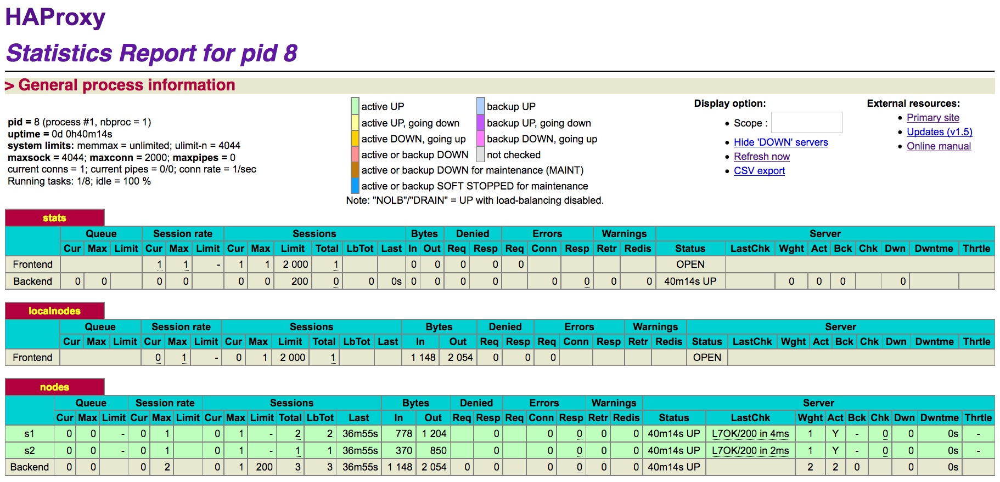
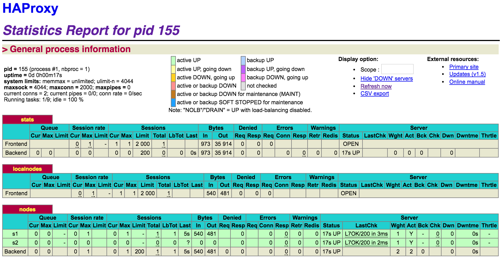

## Lab 04 - Docker

###Index:

0. [Introduction](#intro)
1. [Task 0: Identify issues and install the tools](#task-0)
2. [Task 1: Add a process supervisor to run several processes](#task-1)
3. [Task 2: Add a tool to manage membership in the web server cluster](#task-2)
4. [Task 3: React to membership changes](#task-3)
5. [Task 4: Use a template engine to easily generate configuration files](#task-4)
6. [Task 5: Generate a new load balancer configuration when membership changes](#task-5)
7. [Task 6: Make the load balancer automatically reload the new configuration](#task-6)
8. [Difficulties](#diff)
9. [Conclusion](#conc)

### <a name="intro"></a>Introduction

The goal of this lab is to understand how to configure a dynamic scaling environment for an application in production. Through the different tasks of this lab we will become more familiar with lightweight process supervision for Docker and have a better sight on how Docker works by building our own Docker image. Finally, we will put in practice the decentralized management of web server instances by trying to add or remove some of them.

### <a name="task-0"></a>Task 0: Identify issues and install the tools

1. <a name="M1"></a>**[M1]** Do you think we can use the current solution for a production environment? What are the main problems when deploying it in a production environment?
   
   **Answer**
   
   No clearly not. The main problem is that there is no mechanism to automatically update the HAProxy configuration when a node is added to the cluster. By using this strategy we have to manually update the configuration of the load balancer to add a server which is not really convenient. 

2. <a name="M2"></a>**[M2]** Describe what you need to do to add new `webapp` container to the infrastructure. Give the exact steps of what you have to do without modifying the way the things are done. Hint: You probably have to modify some configuration and script files in a Docker image.

	**Answer**
	
	1. Add a node by starting a new web container.
	
		`docker run -d --name s3 softengheigvd/webapp`
	
	2. Update HAProxy's configuration file manually to add the new node with its IP adresse.

		`server s3 <s3>:3000 check`
	
	3. Update the run script with the following line

		`sed -i 's/<s3>/$S3_PORT_3000_TCP_ADDR/g' /usr/local/etc/haproxy/haproxy.cfg`
	
	4. Rebuilt the container image:

		`docker build -t softengheigvd/ha .`
		
	5. Restart the ha container:

		`docker run -d -p 80:80 -p 1936:1936 -p 9999:9999 --link s1 --link s2 --link s3 --name ha softengheigvd/ha
` 

3. <a name="M3"></a>**[M3]** Based on your previous answers, you have detected some issues in the current solution. Now propose a better approach at a high level.
	
	**Answer**
	
	This approach is clearly not possible for a large cluster of node. A better approach is to automatically update the HAProxy's configuration file when a node is added or removed. Therefor, a system could be used to automatically detect a new node or the loss of a node and react in consequence.
	
4. <a name="M4"></a>**[M4]** You probably noticed that the list of web application nodes is hardcoded in the load balancer configuration. How can we manage the web app nodes in a more dynamic fashion?

	**Answer**
	
	We can use a mechanism to automatically update the configuration of the load balancer when a node is added or removed in the cluster. A cluster membership management tool like *Serf* could help us achieve this goal. By that way, each node will be equipped with a *Serf* agent that will tell each other about event when a node appears or disappears. The load balancer will then react to this event triggering the appropriate scripte to add or remove a node from its configuration file.

5. <a name="M5"></a>**[M5]** In the physical or virtual machines of a typical infrastructure we tend to have not only one main process (like the web server or the load balancer) running, but a few additional processes on the side to perform management tasks.

	For example to monitor the distributed system as a whole it is common to collect in one centralized place all the logs produced by the different machines. Therefore we need a process running on each machine that will forward the logs to the central place. (We could also imagine a central tool that reaches out to each machine to gather the logs. That's a push vs. pull problem.) It is quite common to see a push mechanism used for this kind of task.

	Do you think our current solution is able to run additional management processes beside the main web server / load balancer process in a container? If no, what is missing / required to reach the goal? If yes, how to proceed to run for example a log forwarding process?
	
	**Answer**
	
	For the moment it's not possible to run several process in a container because docker has been designed to run only one process per container. But there is a simple way to have many process beside one. There for we will use a process supervisor which will help us manages deamons and coordinates the boot process. This tool will give us the ability to run multiple processes at the same time in a Docker environment. In this lab we will use the S6 process supervisor.
	
6. <a name="M6"></a>**[M6]** In our current solution, although the load balancer configuration is changing dynamically, it doesn't follow dynamically the configuration of our distributed system when web servers are added or removed. If we take a closer look at the `run.sh` script, we see two calls to `sed` which will replace two lines in the `haproxy.cfg` configuration file just before we start `haproxy`. You clearly see that the configuration file has two lines and the script will replace these two lines.

   What happens if we add more web server nodes? Do you think it is really dynamic? It's far away from being a dynamic configuration. Can you propose a solution to solve this?
   
   **Answer**
   
   If we add more web server node with this configuration, it won't work the way we want. The new server wont be added to the load balancer's configuration file. This configuration isn't dynamic because the task of adding node is still hardcoded in the run script. To solve this problem we will use a template engine to generate a configuration file from variables in a dynamic fashion. In this lab HAProxy's config file is the template we want to update each time a node is added or removed. Therefor, we will put placeholders written in the template's language inside it. Then each time a node is added or removed, data provided by our *Sref* handler script (IP adresses) will be extracted to finally, build a configuration file understandable by the HAProxy. The template engine will orchestrate those tasks. In this lab we will use NodeJS and Handlebars to solve this problem. 
   
**Deliverables:**
   
1.	Take a screenshot of the stats page of HAProxy at http://192.168.42.42:1936. You should see your backend nodes.
	
	**Answer**
	
	

2.	Give the URL of your repository URL in the lab report.
	
	**Answer**
	
	[Link: https://github.com/MichaelRohrer/Teaching-HEIGVD-AIT-2016-Labo-Docker](https://github.com/MichaelRohrer/Teaching-HEIGVD-AIT-2016-Labo-Docker)

### <a name="task-1"></a>Task 1: Add a process supervisor to run several processes

**Deliverables**:
	
1. Take a screenshot of the stats page of HAProxy at <http://192.168.42.42:1936>. You should see your backend nodes. It should be really similar to the screenshot of the previous task.

	**Answer**
	
	
	
2. Describe your difficulties for this task and your understanding of what is happening during this task. Explain in your own words why are we installing a process supervisor. Do not hesitate to do more research and to find more articles on that topic to illustrate the problem.

	**Answer**
	
	To solve this task, we have had no particular difficulties. 
	
	In this task, we have installed a process supervisor to bypass the limitation of docker to run only one process in one container. We have done that because we had to install additional tool to manage our node automatically which mean that several process, like the web application and the *Serf* agent, has to run on it.	
### <a name="task-2"></a>Task 2: Add a tool to manage membership in the web server cluster

**Deliverables**:

1. Provide the docker log output for each of the containers: `ha`, `s1` and `s2`. You need to create a folder `logs` in your repository to store the files separately from the lab report. For each lab task create a folder and name it using the task number. No need to create a folder when there are no logs.

   **Answer**
   
   Done

2. Give the answer to the question about the existing problem with the current solution.

	Anyway, in our current solution, there is kind of misconception around the way we create the Serf cluster. In the deliverables, describe which problem exists with the current solution based on the previous explanations and remarks. Propose a solution to solve the issue.

	**Answer**
	
	The problem with this configuration is that ha has to be started first otherwise the *Serf* agent of the web container won't be able to join ha and agent startup will fail. By default, the agent won't join any nodes when it starts up.
	
	To solve this problem we can use the `-retry-join ha` option. This can be specified multiple times to specify multiple agents to join. If Serf is unable to join with any of the specified addresses, the agent will retry the join every `-retry-interval` up to `-retry-max` attempts. This can be used instead of `-join` to continue attempting to join the cluster.
	
3. Give an explanation on how `Serf` is working. Read the official website to get more details about the `GOSSIP` protocol used in `Serf`. Try to find other solutions that can be used to solve similar situations where we need some auto-discovery mechanism.

	**Answer**
	
	*Serf* use a gossip protocol to communicate with nodes, discover new nodes and finally find which ones are down in an efficient way. This protocol is based on the SWIM Protocol. When starting, *Serf* begin by joining an existing cluster or starting a new cluster. New node in an existing cluster give at least one address to join the cluster then make a full state sync over TCP with the existing member and begins gossiping its existence to the cluster over UDP. Failure detection is done by periodic random probing. If the node fails to ack within a reasonable time, the cluster give it a second chance to answer by sending it indirect probe through selected nodes. If the targeted node still doesn't answer, it is considered as suspicious and after a short amount of time considered as down and removed from the cluster.
	
	*Serf* is one of the solution to solve problems of service discovery. On this [site](http://jasonwilder.com/blog/2014/02/04/service-discovery-in-the-cloud/) you can find a good summary of other solutions that exist to solve such problems. One of them is *Zookeeper* which is a tool that provide a centralized service for maintaining configuration information, naming, providing distributed synchronization, and providing group services. Or *Airbnb’s SmartStack* which is a combination of two custom tools, Nerve and Synapse that leverage *haproxy* and *Zookeeper* to handle service registration and discovery.

   
### <a name="task-3"></a>Task 3: React to membership changes

**Deliverables**:

1. Provide the docker log output for each of the containers: `ha`, `s1` and `s2`. Put your logs in the `logs` directory you created in the previous task.

	**Answer**
	
	Done

3. Provide the logs from the `ha` container gathered directly from the `/var/log/serf.log` file present in the container. Put the logs in the `logs` directory in your repo.

	**Answer**
	
	Done
   
### <a name="task-4"></a>Task 4: Use a template engine to easily generate configuration files

**Deliverables**:

1. You probably noticed when we added `xz-utils`, we have to rebuild the whole image which took some time. What can we do to mitigate that? Take a look at the Docker documentation on [image layers](https://docs.docker.com/engine/userguide/storagedriver/imagesandcontainers/#images-and-layers). Tell us about the pros and cons to merge as much as possible of the command. In other words, compare:

	```
	RUN command 1
	RUN command 2
	RUN command 3
	```
	vs.
		
	```
	RUN command 1 && command 2 && command 3
	```
  
  There are also some articles about techniques to reduce the image size. Try to find them. They are talking about `squashing` or `flattening` images.
  
	**Answer**
	
	When *Docker* builds a new image, it read the *Dockerfile* and for each instruction look in its image cash if it has change since the last time. If some instructions has changed it will then create a new image containing only the content that has changed based on the previous images that already exists. By that way a lot of time is saved when an image is built using the cash.
	
	The RUN command is mainly used to install a new package on top of the main OS distribution. When you use the RUN command, it will execute the instructions and will create a new layer for each RUN commands.
	
	So if we make a new RUN command for each new package, we will have the same amount of layered images which is not really efficient.
  
  It's a good practice to merge commands when we want to update or install new package on a container. Like does the code below.
  
	`RUN apt-get update && apt-get -y install wget curl vim rsyslog xz-utils`
  
	If we don't do so and use `apt-get update` alone in a RUN statement. It will causes caching issues and subsequent apt-get install instructions fail. With this configuration, the first time we build our image every thing goes well but the second time we do so, the docker built mechanism will look in its image cash and see that this command has already been executed. It will then ignore it and reuses the cache from previous steps.

	We can find an interesting article of squashing here:
	* [Squashing Docker Images](http://jasonwilder.com/blog/2014/08/19/squashing-docker-images/)
	* [Flattening Docker Images](http://tuhrig.de/flatten-a-docker-container-or-image/)

2. Propose a different approach to architecture our images to be able to reuse as much as possible what we have done. Your proposition should also try to avoid as much as possible repetitions between your images.

	**Answer**

	The best way to architecture our images is to merge the most possible our RUN commands. This will reduce the number of image in our image layer. We can also use the *Docker* image cash to avoid executing commands that has already been treated once.

3. Provide the `/tmp/haproxy.cfg` file generated in the `ha` container after each step.  Place the output into the `logs` folder like you already did for the Docker logs in the previous tasks. Three files are expected.

	**Answer**
	
	Done
   
   In addition, provide a log file containing the output of the `docker ps` console and another file (per container) with `docker inspect <container>`. Four files are expected.
   
   **Answer**
   
   Done
   
4. Based on the three output files you have collected, what can you say about the way we generate it? What is the problem if any?

	**Answer**
	
	We collected those informations manually which is not very efficient if we had to manage a cluster. Furthermore, the informations we collected here are only infos of containers collected at running time and not infos on the image.


### <a name="task-5"></a>Task 5: Generate a new load balancer configuration when membership changes

**Deliverables**:

1. Provide the file `/usr/local/etc/haproxy/haproxy.cfg` generated in the `ha` container after each step. Three files are expected.
 
   In addition, provide a log file containing the output of the `docker ps` console and another file (per container) with `docker inspect <container>`. Four files are expected.
   
   **Answer**
   
	Done

2. Provide the list of files from the `/nodes` folder inside the `ha` container. One file expected with the command output.

	**Answer**
	
	Done

3. Provide the configuration file after you stopped one container and the list of nodes present in the `/nodes` folder. One file expected with the command output. Two files are expected.
   
    In addition, provide a log file containing the output of the `docker ps` console. One file expected.
    
	**Answer**
	
	Done

### <a name="task-6"></a>Task 6: Make the load balancer automatically reload the new configuration

**Deliverables**:

1. Take a screenshots of the HAProxy stat page showing more than 2 web applications running. Additional screenshots are welcome to see a sequence of experimentations like shutting down a node and starting more nodes.
   
   Also provide the output of `docker ps` in a log file. At least one file is expected. You can provide one output per step of your experimentation according to your screenshots.
   
   **HAProxy managing 3 nodes**
   
   
   
   **HAProxy managing 2 nodes after a node has been removed**
   
   
   
2. Give your own feelings about the final solution. Propose improvements or ways to do the things differently. If any, provide references to your readings for the improvements.

	This solution works pretty well but it is not sophisticate enough to be used on a real cluster that has to be reachable 99.99999 % of the time. Indeed, when a node is added or removed, our template engine take some time to build the new configuration and to load it on the load balancer that need to restart. It results a little loss of availability that could be significant depending on what the cluster is used for. To improve our solution, we could configure HAProxy to reloads with zero down time. We can do this by delaying SYN packets for the duration of the HAProxy restart so that TCP automatically recovers and as that, it would only impose the latency of the HAProxy reload on new connections. 
	
	You can see how it works on this [link](https://engineeringblog.yelp.com/2015/04/true-zero-downtime-haproxy-reloads.html).
	
### <a name="diff"></a>Difficulties

Doing this lab we have had no particular difficulties performing each tasks. If we follow carefully the instruction given in each part of this lab, everything goes well. What was most difficult for us, was to answer, with precision, to the questions about how to improve configuration files or improve the global solution given in this lab.

### <a name="conc"></a>Conclusion

To conclude, this lab was very interesting. It allows us to have a better sight on how to configure a dynamic scaling environment for an application in production. This lab also allowed us to better understand how Docker works, which will be particularly useful for our future job.


